# 概要

お昼の 12 時に Lambda から Slack に通知を飛ばすプログラムです。

# 使用方法

## 1. GCP で API キーを作成

[API キーの使用 ](https://developers.google.com/calendar/api)

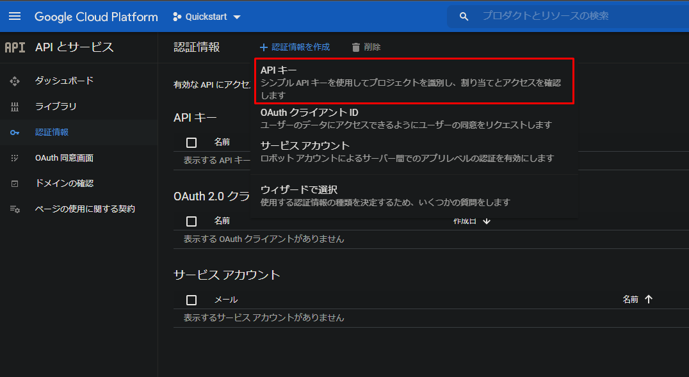

## 2. Google Calendar API を有効化

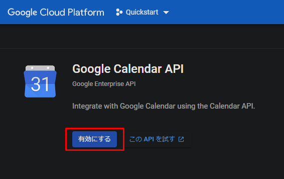

## 3. Slack の Incoming WebHook を有効化

Slack の Incoming WebHook を有効化し、URL を取得します。

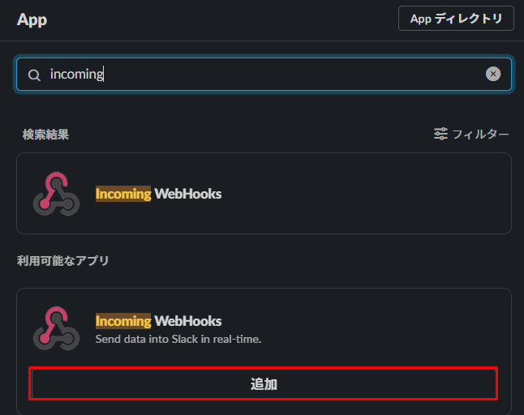

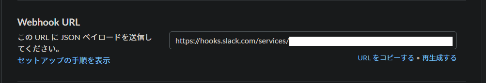

## 4. AWS で Lambda 用の IAM ロールを作成

`AWSLambdaBasicExecutionRole`ポリシーをアタッチします。

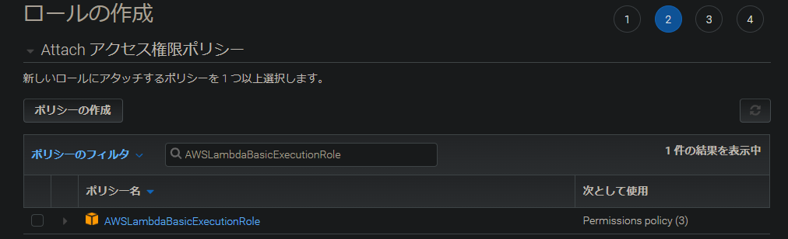

## 5. Lambda 関数を作成

- ランタイム： `Node.js 14.x`
- 実行ロール : 3 で作成した IAM ロール

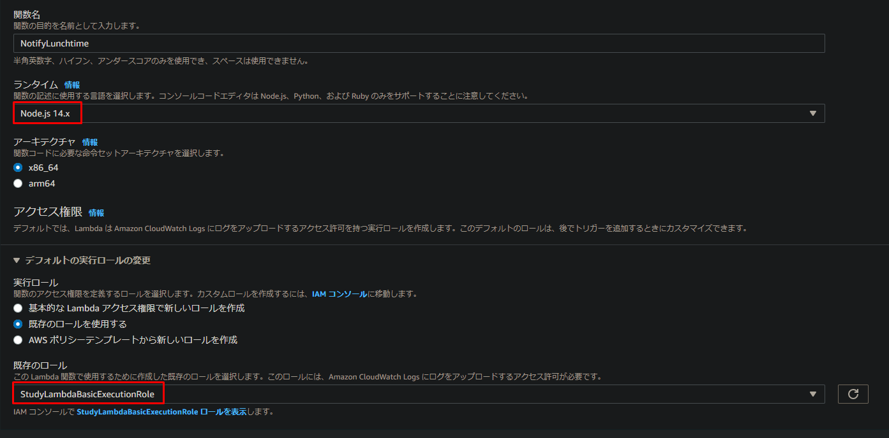

## 6. 環境変数に API キーを登録

- `APIKEY` : `GCPで作成したAPIキーID`

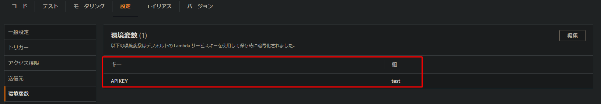

## 7. index.js を編集

- Slack の Incoming WebHook の URL

  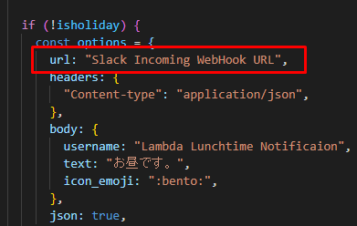

- 任意の休日

  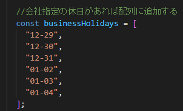

## 8. index.js をアップロード

index.js を Lambda にアップロードするか、コードをコピーして貼り付けます。

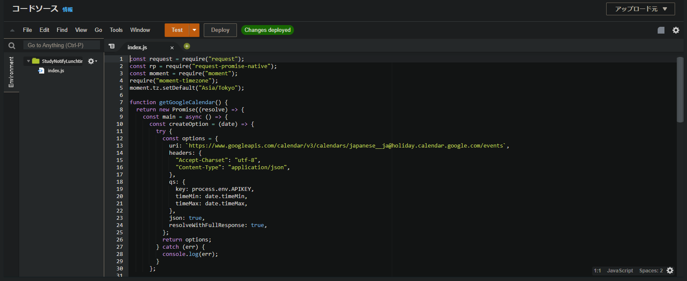

## 9. node_modules を登録

ローカルで`nodejs`という名前のフォルダを作成し、フォルダ内でモジュールをインストールします。

`npm i request request-promise-native moment moment-timezone`

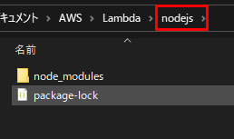

`nodejs`フォルダを zip 化し、Lambda レイヤーにアップロードします。

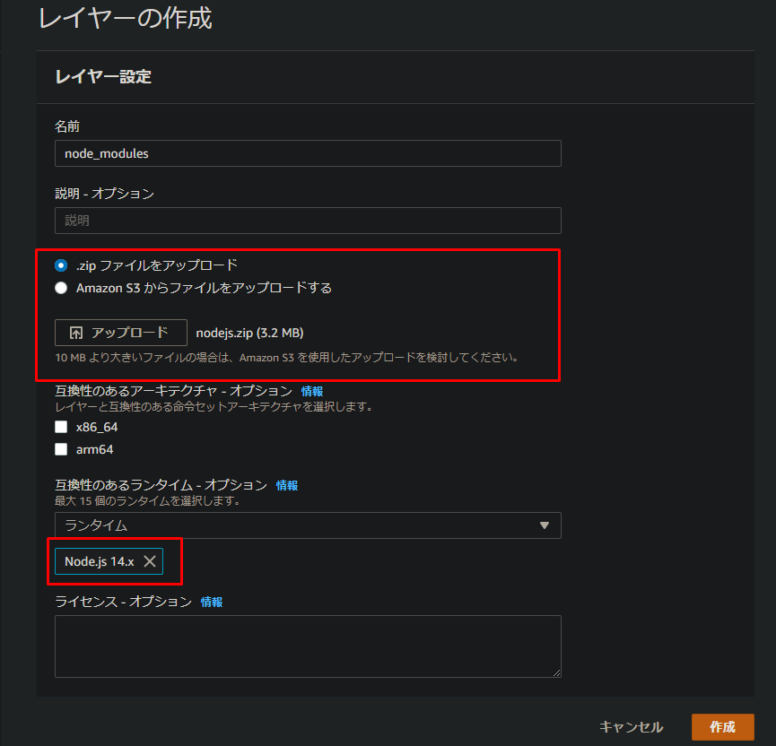

## 10. Lambda 関数のトリガーを作成

トリガーで EventBridge を選択し、スケジュール式に、`cron(0 3 ? * MON-FRI *)`を設定します。
日本時間で、月曜日～金曜日のお昼の 12 時という設定です。

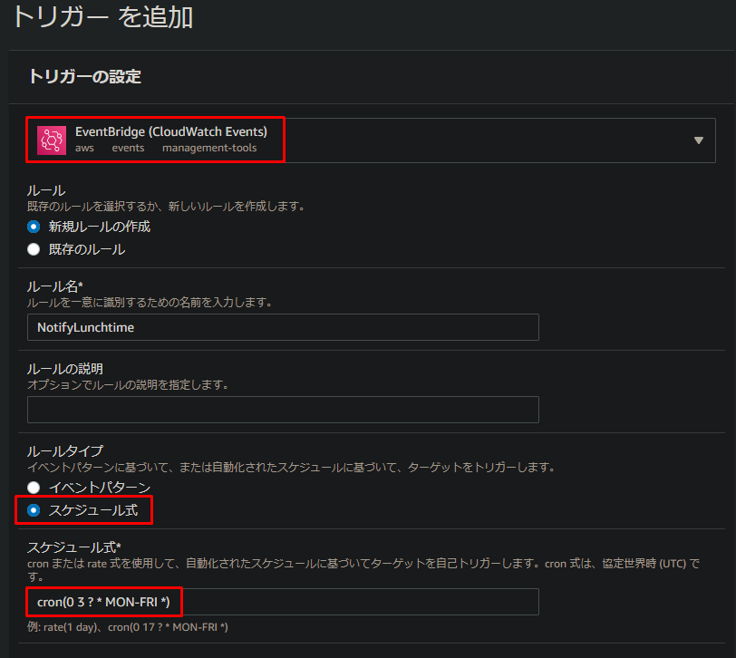

## 11. テスト

必要であれば Lambda でテストしてください。
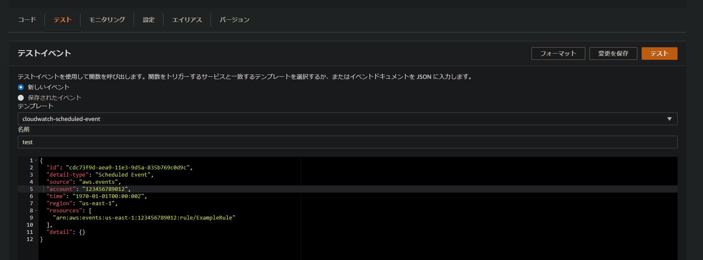
